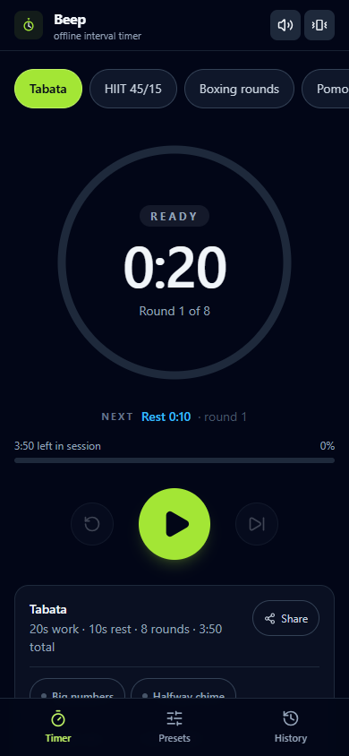
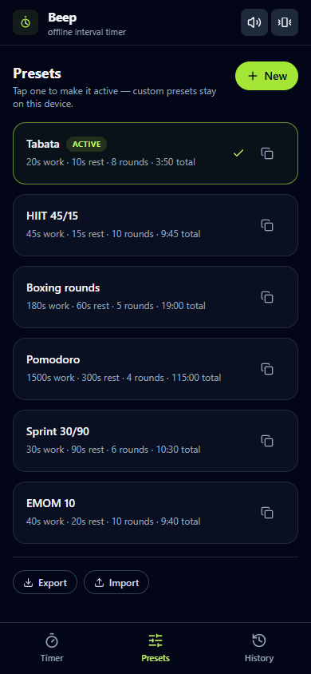
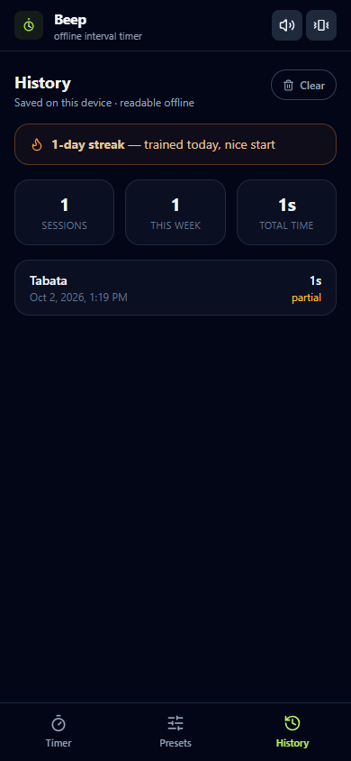
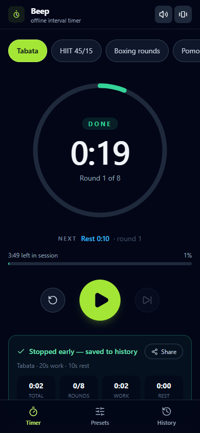
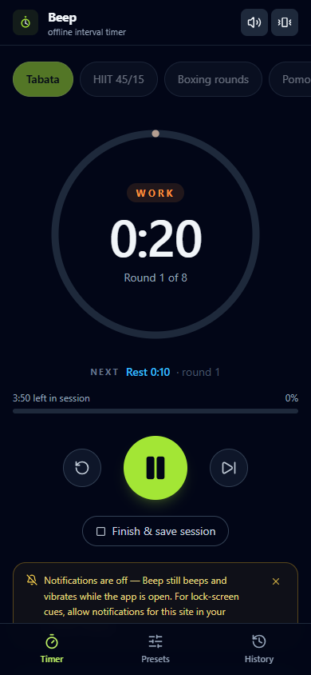

# Z6 · Shipped Mobile App or Installable PWA — **Beep**

[](https://github.com/zakiraziz/Z6-Shipped-Mobile-App-or-Installable-PWA/actions/workflows/deploy.yml)
[](https://github.com/zakiraziz/Z6-Shipped-Mobile-App-or-Installable-PWA/actions/workflows/ci.yml)

**Live installable PWA → https://zakiraziz.github.io/Z6-Shipped-Mobile-App-or-Installable-PWA/**

> An offline-first **interval timer** for HIIT, boxing rounds, sprints and Pomodoro — a focused tool, not a clone. It installs on a phone like a real app and keeps working with **zero connection**: no backend, no account, no third-party APIs.



**Brief:** New platform · 28–32h over 4–5 weeks · Prerequisite: React
**Path chosen:** installable **PWA** (service worker) instead of React Native/Expo — the brief itself says *"a PWA is the easier path if you already know web"*, and one codebase installs on every phone.

---

## Why this idea
- **Focused and useful:** one job — precise work/rest intervals — done properly (progress ring, round counter, cues, history).
- **Offline is the core feature, not a checkbox:** the entire app is client-side. Presets and history live in `localStorage`, beeps are synthesised with Web Audio (no audio files), the shell is precached by a hand-written service worker.
- **Uses real device features:** Wake Lock (screen stays on while a session runs, re-acquired on return — iOS releases it on background), Web Notifications for locked-screen cues, Vibration API cues, `beforeinstallprompt` / Add-to-Home-Screen, full-screen standalone display.

## Features

**Core**
- Interval engine: work/rest segments, round counter, ring + total progress, pause / resume / skip / reset / finish
- **3-2-1 GET READY countdown** before every session — beeps 3-2-1, then the engine starts (second tap cancels)
- **NEXT preview** under the ring ("NEXT · Rest 0:10 · round 2") so you can prepare for what's coming
- **The whole ring is a tap target** — start / pause / resume with a sweaty thumb, no precision aiming
- **Session summary at the end**: total time, rounds completed, honest work/rest split, and one-tap Share (Web Share API → clipboard fallback)
- **Background cues that can't be missed:** when the screen isn't visible, every phase change and the finish fire a persistent service-worker notification (`requireInteraction`, `tag` + `renotify` → exactly one cue at a time, replaced per phase). Permission is requested once, on the first Start tap — never nags.
- **Drift-free catch-up scheduler:** the engine runs on absolute timestamps with a plain interval (rAF stops entirely when backgrounded) and *replays every boundary crossed* — after the OS throttles a slept phone, cues fire with a "N phases passed" summary instead of vanishing silently. Each tick also arms a precise `setTimeout` at the next boundary (an exact wake, not a polled guess), and if a >5 s gap contained crossed phases the catch-up notification is forced **even after you unlock straight into the app** — those cues were physically missed, so the notification says so
- **6 built-in presets (Tabata, HIIT 45/15, Boxing rounds, Pomodoro, Sprint 30/90, EMOM 10)** + create / edit / delete custom presets, duplicate any built-in as an editable copy, and reorder customs with touch-friendly ↑/↓ (order persists)
- **Presets export/import as JSON** — share workouts, back up, move them between devices (import validates + clamps every field and **reports skipped entries and unknown fields explicitly** — nothing is dropped silently) — or **share a preset as a link** (`?p=<base64url>`): the receiver gets an "Add this preset?" card, no file needed
- Session history with stats (sessions, this week, total time) — stored on the device (`localStorage`, `navigator.storage.persist()` requested so it survives storage pressure) — plus a **streak counter** ("3-day streak in a row")
- Countdown beeps for 3/2/1, a distinct Web Audio fanfare per phase, and **distinct haptics per phase** (work = 3 short pulses, rest = 1 long) plus sound / vibration toggles in the header
- Screen-reader announcements on every phase/status change (`aria-live="assertive"`)
- **Preferences where they're used** (chips on the timer card): Big numbers (96px digits for across-the-room viewing), Halfway chime (opt-in midpoint cue), Voice cues ("Work, round 3 of 8" via `speechSynthesis`), Left-handed layout (controls swap sides)
- Denied-permission UX: the Timer screen says **once** (dismissible) that notifications are off and what still works — no silent failure
- "Offline" pill appears the moment the network drops

**Installable PWA**
- Web app manifest (`display_override`, stable `id`) + generated icon set (any + maskable) + standalone display
- Hand-written service worker: network-first HTML, cache-first assets, runtime caching, versioned cache cleanup (`npm run bump:cache`), and `notificationclick` → focuses the open app (falls back to the notification's absolute `data.url`, the Android blank-window trap)
- Update toast ("New version available → Refresh") when a new build is published
- Install banner: native **Install** button on Chromium, Share → Add to Home Screen on iOS — dismissal is remembered and the banner re-offers after 5 sessions
- `prefers-reduced-motion` + `prefers-contrast` support, and a `404.html` SPA insurance redirect for GitHub Pages

> **The claim this version makes:** _"Beep reliably cues you even when your phone is locked in your pocket — via Web Notifications with `requireInteraction` and a drift-free absolute-time scheduler that catches up on missed phase boundaries after the OS throttles a backgrounded tab."_
>
> Honest limits: cues while the screen is off are best-effort — Android throttles background timers to ~1 Hz (and roughly once a minute after long idle), so a notification can lag by up to a minute in deep sleep. The timestamp math means the *timer itself* is never wrong. iOS delivers notifications only for the **installed** app (iOS ≥ 16.4).

## Screenshots

| Timer | Presets | History |
| --- | --- | --- |
|  |  |  |

| Session summary (after finish) | Core feature with the server switched **off** |
| --- | --- |
|  |  |

---

## Tech stack
React 18 · TypeScript · Vite 6 · Tailwind CSS 3 · lucide-react · hand-written service worker — **no backend**, data stays on the device (`localStorage`).

## Run it locally

```bash
npm install
npm run dev          # http://localhost:5173
npm run build        # type-check + production build → dist/
npm run preview      # serve dist/ locally
npm run test:smoke   # automated end-to-end + offline checks (needs Chrome)
```

---

## Test it on a real phone (a requirement of the brief)

**Option A — from the published link (easiest):** open the live URL on your phone, install it (table below), then switch on airplane mode and reopen it from the home screen.

**Option B — from your laptop while building (same Wi-Fi):**

```bash
npm run dev -- --host
# open the printed http://192.168.x.x:5173 URL on your phone
```

> Service workers require a secure context — `localhost` and the HTTPS GitHub Pages link qualify, a plain `http://LAN-IP` does not. So Option B is for UI testing; run the **offline** test against the published link.

**Install it:**

| Platform | Steps |
| --- | --- |
| Android (Chrome) | ⋮ menu → **Add to Home screen** / **Install app** |
| iPhone / iPad (Safari) | Share → **Add to Home Screen** |
| Desktop (Chrome / Edge) | install icon at the right of the address bar |

**Offline test:** airplane mode on → launch from the home screen → run a session → open History. Everything still works.

**Background-cue test (the important one):** start a session → lock the phone or switch apps → at the next phase change you should get a notification ("Work complete — Rest 0:10 — round 3/8") that stays until tapped; tapping it opens Beep. On iOS this works only in the installed app (≥ 16.4).

### Real-device checklist (this is the last DoD box)

**Android — Chrome, installed via ⋮ → Install app**

| # | Step | Pass criteria | If it fails, check |
| --- | --- | --- | --- |
| 1 | Install from the live URL | Icon on home screen, opens standalone (no URL bar) | `display_override` order; `start_url` scope |
| 2 | Grant notifications on first Start | OS dialog appears after tapping Start, never on load | permission call must live inside the gesture handler |
| 3 | Start a session, lock the phone | Screen off, timer still running | — |
| 4 | Wait for the next boundary | Notification arrives within ~5 s of the phase change | `data.url` present; `showNotification` not throwing |
| 5 | Tap the notification | Beep opens focused — not a blank tab or new window | `notificationclick` focus branch vs `openWindow` |
| 6 | Lock again, sleep through 3+ phases | On unlock: catch-up notification says "N phases passed" | 5 s gap threshold; boundary-crossing replay |
| 7 | Feel work vs rest haptic | Work = 3 short pulses, rest = 1 long, no double-fire | one `cuePhaseChange` per boundary |
| 8 | Airplane mode, cold launch from home screen | App loads from SW cache, timer runs | SW install/activate caching |

**iOS — Safari ≥ 16.4, installed via Share → Add to Home Screen**

| # | Step | Pass criteria | If it fails, check |
| --- | --- | --- | --- |
| 1 | Install from the live URL | Icon on home screen, opens standalone | manifest `display: standalone` |
| 2 | First Start | Audio unlock blip plays (silent but present) | `primeAudio()` inside the gesture |
| 3 | Background the app | AudioContext suspends (expected) | — |
| 4 | Return to the app | Audio resumes, ring shows no missed time | `visibilitychange → visible → resumeAudio()` |
| 5 | Lock screen mid-session | **No notification expected** — Android gets real background cues; iOS is best-effort (installed PWAs ≥16.4 only, still limited) | this is the honest caveat above, not a bug |
| 6 | Screen stays awake in foreground | Wake lock held, re-acquired after backgrounding | `wakeLock.request` + `.released` re-acquire |

Tick the Definition of Done box after both tables pass.

## Definition of Done

- [x] **Installable on a real device** — manifest + icons + service worker verified by `npm run test:smoke` (standalone display, 3 icons, active SW, native install prompt in Chrome)
- [x] **Core feature works offline (PWA)** — verified by an automated test that **kills the preview server**, reloads the app from the service-worker cache and runs a timer on it
- [x] **Published** — GitHub Pages; every push to `main` redeploys via GitHub Actions
- [ ] **Tested on at least one real device** — 👉 *your turn: 5 minutes with Option A above, then tick this box*

## Publish / re-deploy

`.github/workflows/deploy.yml` builds, runs the full smoke test (a failing test **blocks the deploy**), then **asserts `dist/` is byte-identical to the fresh build** — tests must never modify release output — before uploading it, and deploys on every push to `main`; `.github/workflows/ci.yml` runs the same test + pristine-`dist` assert on every push/PR and uploads the screenshots as artifacts.
First time only: repo **Settings → Pages → Source: GitHub Actions**.
Any other static host works too — the build uses a relative base (`base: './'`), so `dist/` can be dropped into any sub-folder (Netlify, Vercel, Surge…).

## Project structure

```
├─ index.html                # PWA meta, manifest link, iOS tags
├─ public/
│  ├─ sw.js                  # SW: caching + notificationclick (hand-written)
│  ├─ manifest.webmanifest   # install metadata
│  ├─ 404.html               # GitHub Pages → app root redirect
│  └─ icons/                 # 192 / 512 / maskable / apple-touch (rendered from tools/icon.html)
├─ src/
│  ├─ App.tsx                # shell: tabs, wake lock, storage.persist, visibility handling
│  ├─ state.tsx              # persistent state + timer wiring (React context)
│  ├─ hooks/useIntervalTimer.ts  # interval + timestamp engine, replays crossed boundaries
│  ├─ hooks/…                # wake lock, install prompt, online status, localStorage
│  ├─ lib/cues.ts            # sound + haptics + notifications, one dispatcher per phase
│  ├─ lib/notify.ts          # permission flow (ask once), SW notifications, cleanup
│  ├─ lib/sound.ts           # Web Audio cues + iOS unlock / resume
│  ├─ lib/presets-io.ts      # preset JSON import/export + ?p= share links
│  └─ components/            # Timer (+ summary & preference chips), Presets, History, banners
├─ scripts/smoke.mjs         # headless-Chrome end-to-end + offline test (cross-platform)
├─ scripts/bump-cache.mjs    # npm run bump:cache → sw.js cache version++
├─ tools/icon.html           # source of the PNG app icons
└─ .github/workflows/        # deploy.yml (test-then-deploy) + ci.yml (test on push/PR)
```

## Automated checks — `npm run test:smoke`

19 checks in real headless Chrome: app renders · zero console/page errors · no horizontal overflow at 390 px · **NEXT preview present before start** · manifest installable · service worker active · **3-2-1 get-ready countdown appears on Start** · start + finish a session (this also exercises the notification-permission flow) · **session summary renders after finish** · history persisted to `localStorage` · export/import controls present · **server killed → app reloads from cache → timer still runs** · **changed asset + changed sw.js bytes → update toast appears → Refresh serves the new file without a hard reload** (the exact path a `bump:cache` release takes) · and it regenerates the screenshots above.

The same test runs on every push/PR in **GitHub Actions** (`.github/workflows/ci.yml`, screenshots uploaded as artifacts) and gates the Pages deploy.

> **Deliberate non-goals:** no Lighthouse CI — the PWA audit category was removed in Lighthouse 12 and perf scores on shared runners are flaky, so the smoke test asserts installability/offline behaviour directly instead. No Playwright either: the puppeteer-core harness covers the same ground with zero extra dependencies. Chrome is resolved per platform (`CHROME_PATH` env overrides) rather than version-pinned.

> **War story (why the pristine-`dist` assert exists):** _Beep cues you even when your phone is locked in your pocket — precise boundary wakes, persistent notifications with a working `notificationclick`, catch-up summaries after OS throttling. My own cache-bump test once shipped `v999` to prod; the deploy is now gated on a byte-identical `dist/` checksum, because the first version of that gate I wrote would have passed vacuously on a gitignored path._

## If you get stuck

- **Blank page on the phone?** Same Wi-Fi + `--host`, and use the HTTPS link for anything involving the service worker.
- **No notification appears?** Permission is asked on the first Start tap (check the site's notification settings); Android must not have the app force-stopped; iOS requires the *installed* app (≥ 16.4). `notificationclick` is already wired in `sw.js`.
- **SW cache feels stale?** DevTools → Application → Service Workers → Unregister (normally the update toast handles it), or run `npm run bump:cache` before releasing icon/manifest changes.
- **Remote push (stretch):** the local cue system needs no server; true remote push would add a `push` handler in `public/sw.js` plus a push-service subscription in `lib/notify.ts`.
- **App-store (stretch):** wrap this same PWA with [PWABuilder](https://www.pwabuilder.com) for a Play Store listing.

---

Built for **Z6** — from React on a screen to software that lives on a phone. 📱
